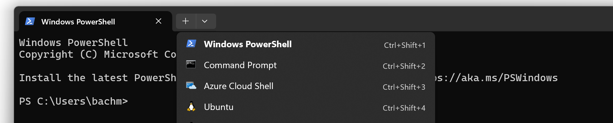

# Using BetterR from Windows with WSL

Although it should be straightforward to get BetterR working on Windows with a "native" workflow, where you install a Windows version of the D compiler and do your compilation using traditional Windows development tools, the reality is that I don't have the time to figure out how to get all of that working or to support users that primarily use scripting languages. As a Linux user, even if I had lots of excess time, I would not have the expertise needed to provide users with technical support as they set up a native Windows workflow. I will be happy to work with anyone wanting to do that job. If you're experienced with D development on Windows, it probably won't be difficult.

You should not take the above statement to mean I never do D programming on Windows. I actually do quite a bit of development on a Windows laptop, but not using a traditional Windows workflow. Instead, I use the combination of Windows Subsystem for Linux (WSL) and VS Code. I'd honestly recommend this approach for anyone that's using languages like R and Python on Windows. The learning curve to get going with the traditional Windows development workflow is steep, and if you're interested in BetterR, you'll probably find the WSL-based workflow much easier.

## What's WSL?

WSL is a Windows feature that allows you to run a Linux distribution inside of Windows. It's an official part of Windows, maintained and supported by Microsoft, though you've probably never heard of it if you're not a software developer. You can learn more about it [in this article](https://learn.microsoft.com/en-us/windows/wsl/about).

## Install WSL

You can find details about installing WSL in [this Microsoft tutorial](https://learn.microsoft.com/en-us/windows/wsl/install). I strongly encourage you to go with the default Linux distribution, which is currently Ubuntu 22.04.

## Install VS Code

You can download and install VS Code [at the official download site](https://code.visualstudio.com/download).

## Connecting VS Code to WSL

The next step is to [connect to WSL from VS Code](https://code.visualstudio.com/docs/remote/wsl-tutorial).

## Install Windows Terminal Preview

Windows Terminal Preview is an excellent terminal with built-in support for WSL. You can install it through the Microsoft Store. If you don't like the Microsoft Store, you [have other options](https://github.com/microsoft/terminal).

## Install R and RInside

In Windows Terminal Preview, open your Ubuntu 22.04 WSL.



Now install R and RInside:

```
sudo apt install R
```


Open R and install RInside:

```
R

> install.packages("RInside")
```


## Install BetterR

The easiest way to install BetterR for now is to clone the repository. You might need to install git first.

```
sudo apt install git
mkdir ~/repos
cd ~/repos
git clone https://github.com/bachmeil/betterr.git
```

You can use the installation utility to install it to the working directory of your choice:

```
mkdir ~/project
rdmd ./install.d ~/project
```


Now you can return to VS Code, connect to the WSL session, and open the project directory in ~/project.
